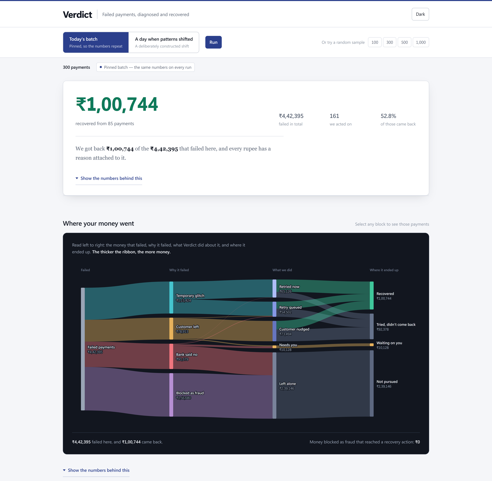
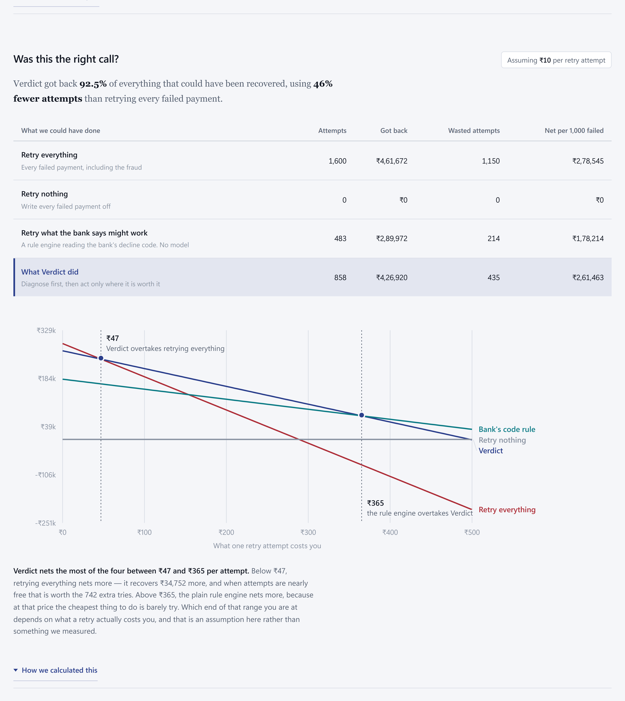
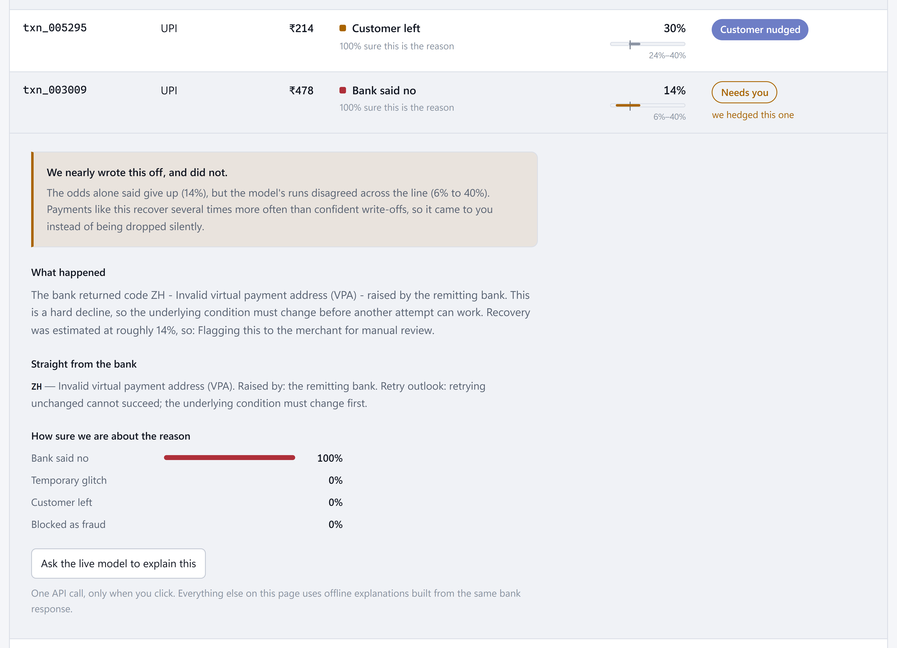
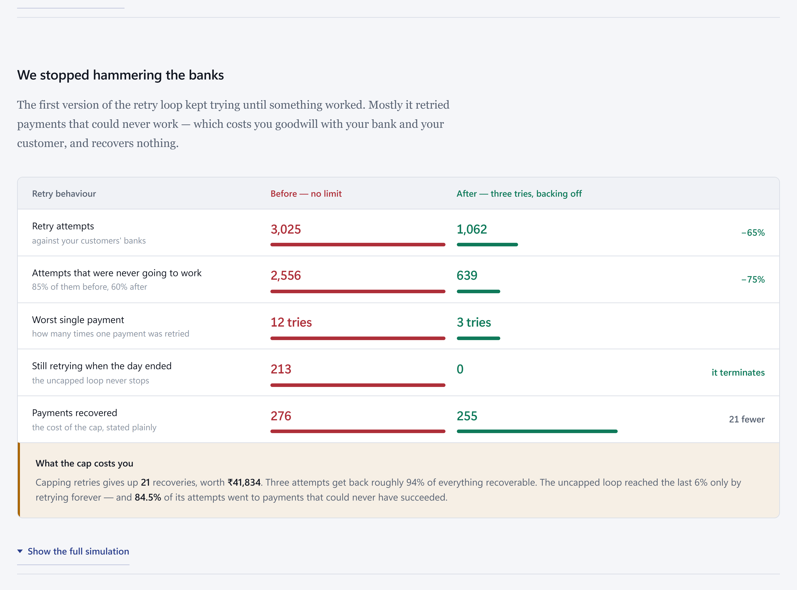

# Verdict

**Diagnoses *why* a payment failed, then decides the economically correct recovery
action — instead of treating "failure" as one undifferentiated bucket.**

[**Live demo →** verdict-1v70.onrender.com](https://verdict-1v70.onrender.com/) · Python 3.11 · FastAPI · XGBoost · 158 tests

> Two models and one agent. The first works out *why* a payment failed, the second
> estimates whether recovering it would actually succeed, and only then is anything
> decided. Every decision is auditable, every number on screen is checkable, and the
> places where this approach loses are written on the page next to the places it wins.



### On the pinned demo batch

| | |
|---|---|
| Payments | 300 failed, worth **₹4,42,395** |
| Recovered | **₹1,00,744** across 85 payments |
| Acted on | 161 of 300 — 52.8% of those came back |
| Blocked as fraud | 33, and **none** were scored or retried |
| Rail skew | 47.9% of card failures are permanent declines; 41.9% of UPI failures are customers walking away |

Those are the numbers in the screenshots because the dashboard opens on a **committed**
300-row batch, not a random sample. See [Reproducible demo batch](#reproducible-demo-batch).

---

## The problem

Payment gateways lose real revenue to failed transactions, but not all failures are the
same and not all deserve the same response:

- A bank-side timeout is often recoverable with a retry.
- Insufficient funds is not — retrying wastes an attempt and annoys the customer.
- A fraud block should never be retried, under any circumstances.
- A customer who abandoned mid-flow needs a nudge, not a silent retry.

Most systems collapse this into one failure-rate number. Verdict treats it as a
diagnosis problem: classify the failure, estimate the odds a recovery action would
succeed, then decide what to do.

## How it works

```
transaction ──▶ Failure Classifier ──▶ category
                                          │
                        (returns here if fraud_block)
                                          ▼
                              Recovery Success Model ──▶ probability + interval
                                          │
                                          ▼
                                   Recovery Agent
                                          │
                         ┌────────────────┼────────────────┐
                         ▼                ▼                ▼
                  action decision   explanation (LLM)   audit log
```

1. **Failure Classifier** — predicts the failure category from features available at the
   moment of failure: `hard_decline`, `soft_decline`, `customer_dropoff`, `fraud_block`.
2. **Recovery Success Model** — predicts the probability a retry or nudge recovers the
   payment, conditioned on the classifier's full probability vector, **with an
   uncertainty interval alongside the point estimate**. Never invoked for `fraud_block`.
3. **Recovery Agent** — combines both into one of five actions (`auto_retry_now`,
   `retry_later`, `customer_nudge`, `escalate`, `no_action`) and narrates the decision
   through an LLM adapter.

### Why cards *and* UPI

The two rails fail for structurally different reasons:

- **Cards** fail on issuer/network grounds — insufficient funds, do-not-honor, expired
  card, 3DS abandonment, fraud. Skews to `hard_decline` / `fraud_block`.
- **UPI** fails operationally — PSP/NPCI downtime, PIN errors, timeouts, app-switch
  abandonment, daily limit caps. Skews to `soft_decline` / `customer_dropoff`.

Modelling both makes `payment_method` a load-bearing feature rather than decoration: the
classifier has to learn method-conditional failure patterns, which is closer to the real
problem.

---

## Was acting selectively actually worth it?

The obvious challenge to any system like this is *"why not just retry everything?"*.
So that was measured, over the 1,600 held-out payments the models never saw.



| Policy | Attempts | Recovered | Revenue | Wasted attempts |
|---|---:|---:|---:|---:|
| Retry everything | 1,600 | 450 | ₹4,61,672 | 1,150 |
| Retry nothing | 0 | 0 | ₹0 | 0 |
| Retry what the bank's decline code says might work | 483 | 269 | ₹2,89,972 | 214 |
| **Verdict** | **858** | **423** | **₹4,26,920** | **435** |

**Verdict captures 92.5% of all recoverable revenue using 46% fewer attempts.** That
claim holds at any cost assumption.

Net value does not. It is `revenue − attempts × cost`, so the ranking depends entirely
on what one retry costs you:

- **Below ₹46.84 per attempt** — retrying everything nets more. It recovers ₹34,752
  more; it just needs 742 extra attempts to do it.
- **₹46.84 to ₹365.20** — Verdict nets the most.
- **Above ₹365.20** — the plain rule engine wins, because at that price the cheapest
  thing to do is barely try.

The cost per retry is an **assumption, not a measurement** — nothing here measures it,
and it is the single number that decides the winner. That is why the whole range is
swept rather than one flattering figure reported.

**No policy can see the outcome it is scored against.** `retry_success` and
`failure_category` are dropped from the frame before any policy decides; the outcome is
read once, in `score()`, after every decision is made. `tests/test_policy_eval.py`
asserts this two ways, and the stronger one hands each policy the *raw* frame with every
outcome flipped and requires bit-identical decisions.

Run it yourself: `python scripts/policy_eval.py`.

---

## Every decision is on the record



Any row in the dashboard's ledger expands into the reasoning behind it:

- **The grounded cause.** Explanations are constrained to a verified table of published
  decline-code meanings ([`src/error_taxonomy.py`](src/error_taxonomy.py)) — ISO 8583
  references for cards, an NPCI reference for UPI. The model narrates that table; it
  does not invent bank terminology for a code it has not seen.
- **The full confidence vector**, not just the winning label.
- **The uncertainty range** under the point estimate, drawn on 0–1 with a tick at the
  threshold that row's decision actually turned on.
- **Whether uncertainty changed the decision**, and which rule fired.

### Uncertainty changes *how* the agent acts, not *how much* it recovers

Model 2 carries an interval — the spread across its five calibration folds, which costs
no retraining and provably cannot move the point estimate, since the estimate is the mean
of those same folds. Near a threshold, width matters:

- **Uncertain above the auto-retry line** → retry with backoff instead of immediately.
  A hedge, not a withdrawal.
- **Uncertain below the give-up line** → send for human review instead of silently
  writing the payment off.

The asymmetry is measured, not assumed. Escalating uncertain auto-retries is the obvious
move and it is wrong — those payments recover slightly **more** often than confident ones
(0.611 vs 0.604), so pulling them out of the retry path destroys revenue. At the give-up
line the opposite holds: payments whose interval crosses the floor recover **3.3× more
often** than confident give-ups (0.120 vs 0.036).

Both adjustments move between actions of the same kind, so **recovered revenue is
identical with the rule on or off**. Passing no interval reproduces the original
behaviour exactly.

### What the fraud hard-block guarantees

Two claims, deliberately kept apart:

- **Architectural, absolute.** Anything diagnosed `fraud_block` is never acted on and
  never scored. **207 diagnosed, 0 actioned, 0 scored.** Three independent guards: the
  agent returns before Model 2 or the LLM is reached, Model 2 raises if fraud rows enter
  training, and every adapter raises if invoked with a fraud category.
  [`tests/test_agent_rules.py`](tests/test_agent_rules.py) proves it with spy objects
  that fail the build on contact — a post-hoc filter would pass a naive
  `action == no_action` assertion but fail these.
- **Detection is not absolute.** Model 1's fraud recall is **0.985, not 1.0**. The
  architecture guarantees behaviour *given* a diagnosis; it cannot guarantee the
  diagnosis. 3 of 204 true fraud payments were not recognised as fraud, one of which was
  acted on. That is a detection miss, and it is reported rather than hidden.

---

## Retries under control



The retry loop was built without a cap first, on purpose. Over 12 polling cycles on 489
retry-eligible payments:

| | Uncapped | Budget of 3 + backoff |
|---|---:|---:|
| Retry attempts | 3,025 | **1,062** (−64.9%) |
| Attempts that could never succeed | 2,556 (84.5%) | 639 (60.2%) |
| Worst case on one payment | 12 tries | **3 tries** |
| Still queued at the end | 213 | **0** |
| Payments recovered | 276 | 255 |

The uncapped loop did **2.85× the work for 8% more recoveries** (₹2,83,980 vs
₹2,42,145 — 17% more value), and its worst case is unbounded, because everything left in
that queue is unrecoverable by construction. **The cap costs 21 recoveries, worth
₹41,834**, and the dashboard states that rather than hiding it.

## Drift monitoring

The models were trained once, on one batch. `GET /stats/drift` checks whether the batch
currently loaded still resembles that training distribution, using **PSI (Population
Stability Index)** on every monitored feature — the standard metric in credit-risk and
fraud model monitoring, with its conventional cutoffs (`< 0.10` stable, `0.10–0.25`
moderate, `> 0.25` significant).

PSI is used for *every* feature rather than mixing in a KS test, so all six sit on one
scale and a combined verdict means something; KS is continuous-only and three of the six
are categorical. The overall verdict is the **maximum**, never the average — averaging
lets one badly drifted feature hide behind stable ones.

| | Representative batch | Constructed shift |
|---|---|---|
| UPI share | 0.43 | 0.65 |
| Fraud share | 0.11 | 0.21 |
| Verdict | **LOW** (0.083) | **MODERATE** (0.172) |

The shifted batch in the dashboard's picker is **constructed on purpose**
([`scripts/make_drift_demo.py`](scripts/make_drift_demo.py)) by re-weighting which
held-out rows get sampled. No values are invented, but the drift was introduced
deliberately — it was not observed in real traffic, and synthetic data cannot drift on
its own.

Entirely read-only: it reads no model, changes no threshold, and cannot alter a decision.
Tests assert agent output is byte-identical with and without it, and that nothing in
`src/agent/` imports the monitoring package.

One near-miss worth knowing: the first version reported the *representative* batch as
MODERATE. That was sampling noise — `error_code[upi]` had a median PSI of 0.139 on
batches with no drift at all, because 17 levels against ~135 UPI rows leaves 3–6
observations per bin. Rare levels are now merged and a test pins the noise floor below
the stable cutoff.

---

## Model results

| | Model 1 (XGBoost) | Naive `error_code` lookup |
|---|---|---|
| Accuracy | **0.943** | 0.809 |
| Macro-F1 | **0.945** | 0.799 |

The lookup baseline is not decoration — see [What broke](#what-broke). **82% of the
model's remaining errors are the single `soft_decline` ↔ `customer_dropoff` pair** (75 of
91), which is the ambiguity this project was designed to expose. `hard_decline` sits at
0.987 recall and `fraud_block` at 0.985.

**Model 2:** ROC-AUC 0.784, PR-AUC 0.550, isotonic-calibrated (Brier 0.174 → 0.169) over
1,396 scored payments. Calibration is a correctness requirement, not polish — the agent
reads its economic cutoffs directly off this probability scale, so a score of 0.6 has to
mean roughly 60% in practice.

Trained on 6,400 rows, evaluated on a held-out 1,600.

### Agent decisions

Thresholds were derived from Model 2's measured score distribution, not guessed. The
distribution is bimodal, so the cutoffs sit at **0.50** ("recovery is more likely than
not — just retry it") and **0.25** (the valley floor between the recoverable and
unrecoverable modes). The original plan's 0.6 would have sent only 1.6% of payments to
`auto_retry_now`.

| Action | Count | Share | Observed recovery |
|---|---:|---:|---:|
| `auto_retry_now` | 194 | 12.1% | 0.624 |
| `retry_later` | 295 | 18.4% | 0.525 |
| `customer_nudge` | 369 | 23.1% | 0.398 |
| `escalate` | 35 | 2.2% | 0.229 |
| `no_action` | 707 | 44.2% | 0.027 |

The agent acts on **53.6%** of failures (858 of 1,600), recovers **₹4,26,920**, and
leaves only **27 recoverable payments** untouched. The middle band splits on *category*,
not probability: identical odds mean different things depending on whether a bank refused
or a human walked away.

---

## What broke

**Our headline metric was lying to us.**

Before training the classifier, I checked whether the problem was actually learnable. It
wasn't. **7,057 of 8,000 rows (88%) had an error code that mapped to exactly one failure
category** — so the "classifier" scored **96.6% accuracy by memorising a lookup table**,
versus 60.8% without the code. The number looked excellent and meant nothing, and it
invalidated the project's central claim that diagnosing a payment failure is a real
problem.

The cause was mine. My data generator gave each failure category a private, disjoint list
of error codes. Real payment data is messier: `05` "do not honor" is a deliberately
opaque catch-all issuers use to mask both fraud suspicion and insufficient funds; an
issuer timeout (`91`, `U67`) is exactly where a stalled *customer* hides behind a *system*
code; a wrong UPI PIN (`ZM`) often ends in the customer simply giving up.

I rebuilt the generator so categories emit from *overlapping* code distributions, leaving
genuinely unambiguous codes (`51` insufficient funds, `54` expired card) near-pure — the
goal was realism, not uniform mud. Deterministic rows fell from 88% to 42%, and the
naive-lookup ceiling from 96.4% to 80.4%.

The second-order problem was subtler: overlap alone would just add irreducible noise that
no model could beat the lookup on, so the overlap had to be **resolvable from behaviour**.
That meant sharpening category-conditional feature distributions and adding a
`seconds_to_failure` dwell-time signal, without which card drop-off versus soft decline
on code `91` was structurally unresolvable.

The retrained model reaches **94.3% accuracy against an 80.9% lookup baseline** — a real
13.4-point lift instead of a memorised one.

**The fix is a guardrail, not a one-off correction.** `scripts/train.py` now computes the
naive lookup baseline on every run and **fails the build if the model ever stops beating
it**. A model that cannot outperform ten lines of dictionary lookup should not be allowed
to call itself a model.

Runner-up, kept because it is the better story about testing blind spots: the demo used
`.head(n)` to sample, so it replayed one byte-identical batch forever — and **71 passing
tests missed it**, because every test asserted on the shape of a single response and none
compared two responses to each other. There is now a test that calls an endpoint twice
and demands the answers differ. Full write-ups in
[`docs/failure_stories.md`](docs/failure_stories.md).

---

## Running it

Verified end to end from a fresh clone into a fresh virtualenv, on Python 3.11.

```bash
python -m venv .venv && .venv/Scripts/activate            # Windows
# python3 -m venv .venv && source .venv/bin/activate      # macOS / Linux

pip install -r requirements.txt

python src/data_generation/generate_transactions.py       # -> data/raw/
python scripts/prepare_data.py                            # -> data/processed/
python scripts/train.py                                   # -> models/, reports/
python scripts/evaluate_agent.py                          # -> action mix + revenue
python scripts/retry_storm_demo.py                        # -> retry-storm before/after
python scripts/policy_eval.py                             # -> four-policy comparison
python scripts/make_drift_demo.py                         # -> constructed drift scenario

uvicorn src.api.main:app
```

Open **http://localhost:8000**. `data/`, `models/` and `reports/` are created by those
scripts — a fresh clone does not contain them and does not need to.

```bash
pytest tests/          # 158 tests
```

For live LLM explanations, copy `.env.example` to `.env` and set `GEMINI_API_KEY`
([free tier](https://aistudio.google.com/apikey)), then `python scripts/check_llm.py` —
one real call, verifying the answer stays grounded in the error-code taxonomy.

### Reproducible demo batch

The dashboard opens on a **pinned batch** of 300 committed payments in
[`data/demo/demo_batch.csv`](data/demo/demo_batch.csv), so the numbers on screen are the
numbers in the documentation, every run. It was chosen by
[`scripts/make_demo_batch.py`](scripts/make_demo_batch.py), which scans candidate samples
for one showing all five actions (including `escalate`, only ~2% of traffic), a visible
card-vs-UPI skew, fraud-blocked rows, and a recovered figure that is easy to say out loud.

**The rows are committed rather than the seed.** A seed only reproduces the same batch
against a byte-identical `test.csv`, so regenerating the data would silently change every
quoted number. Provenance lives in `data/demo/demo_batch.json` and a test asserts the
batch still matches it.

Selecting a random sample size in the picker draws a genuinely fresh sample on every
click.

## API

One server, one port. FastAPI serves both the API and the dashboard.

| Endpoint | Purpose |
|---|---|
| `GET /` | The dashboard, same origin as the API |
| `GET /health` | Model status, active LLM adapter, live thresholds |
| `POST /decide` | Decide one failed payment — the only path that may call a live LLM |
| `POST /simulate/batch` | Decide a caller-supplied batch |
| `POST /simulate/seed` | Replay `n` held-out payments (fresh sample each call) |
| `POST /simulate/demo` | Replay the pinned demo batch |
| `POST /simulate/drift-demo` | Replay the constructed drift scenario |
| `GET /stats/breakdown` | Category and action breakdown for the current batch |
| `GET /stats/recovered-revenue` | Expected vs realised recovered revenue |
| `GET /stats/drift` | PSI drift of the current batch against training |
| `GET /decisions` | The audit log, most recent first |
| `GET /reports/metrics` | Committed model metrics |
| `GET /reports/policy-eval` | Committed four-policy comparison |
| `GET /reports/retry-storm` | Committed retry-storm before/after |
| `GET /reports/drift-comparison` | Committed normal-vs-shifted drift comparison |

## Repo structure

```
assets/             # dashboard screenshots used in this README
data/
  raw/              # generated synthetic transactions (gitignored)
  processed/        # train/test splits (gitignored)
  demo/             # the pinned demo batch -- COMMITTED
src/
  data_generation/  # synthetic data generator (cards + UPI, method-conditional)
  models/           # failure classifier + recovery success model
  agent/            # decision logic, retry simulator, LLM adapter interface
  api/              # FastAPI serving layer
  dashboard/        # single-file dashboard (no build step), served at GET /
  monitoring/       # PSI drift detection -- read-only, observes only
  error_taxonomy.py # grounded error_code -> meaning, what the LLM is held to
  features.py       # shared feature spec + encoder (one definition, both models)
  paths.py          # canonical project paths
models/             # trained artifacts (created by train.py, gitignored)
reports/            # metrics, policy eval, retry storm, drift comparison, plots
docs/               # decisions log, deployment, "what broke", build plan
scripts/            # prepare_data, train, evaluate_agent, policy_eval,
                    #   retry_storm_demo, make_demo_batch, make_drift_demo, check_llm
tests/              # guard tests for the architectural hard rules
```

Evaluation artifacts are emitted as PNG/JSON by `scripts/train.py` rather than living in
notebooks, so they are reproducible, run headless, and drop straight into the dashboard.

## Design notes

**The dashboard** is one self-contained HTML file — no build step, no `npm install`, no
CDN — served by FastAPI itself, so it runs same-origin with the API and works with no
internet. A test asserts no external reference ever creeps in. The money-flow diagram and
the sensitivity chart are hand-rolled inline SVG for that reason.

**The LLM adapter** is provider-swappable by design. The agent never calls an SDK
directly; it calls one interface:

```python
def generate_explanation(transaction, category, recovery_prob, action) -> str
```

This got tested for real. Paid Anthropic access went away mid-build and the live path
moved to Google Gemini's free tier — the swap touched exactly one file
([`src/agent/llm_adapter.py`](src/agent/llm_adapter.py)) plus the `/health` reporting
block. No agent logic, no thresholds, no fraud rules, no model code.

| Adapter | Model | Selected when |
|---|---|---|
| `GeminiAdapter` | `gemini-2.5-flash-lite` | `GEMINI_API_KEY` set — **active** |
| `ClaudeAdapter` | `claude-haiku-4-5` | `ANTHROPIC_API_KEY` set, no Gemini key |
| `TemplateAdapter` | — | no key at all |

**Decisions are identical under all three** — the LLM narrates a decision the threshold
policy already made. On a free tier, rate limits are the steady state rather than an edge
case, so a 429 degrades to the grounded template instead of failing the request.
Measured burst behaviour and quota strategy are in
[`docs/decisions.md`](docs/decisions.md).

**Quota safety.** Normal dashboard use makes **zero** live-provider calls — everything
that loops is served by the offline template adapter, with live narration reserved for
the opt-in *"Ask the live model to explain this"* button on a single expanded row. A spy
adapter in the test suite fails the build if that ever stops being true.

Design rationale is logged in [`docs/decisions.md`](docs/decisions.md); deployment in
[`docs/deployment.md`](docs/deployment.md).

## Limitations

Stated plainly, because several of them are what make the rest possible.

- **The data is synthetic**, deliberately. The counterfactual outcome label —
  *would* a retry have worked — exists for every payment, including those no policy
  retried. Real production data never has that: you only learn the outcome of attempts
  you actually made. It is what makes the policy comparison possible at all, and it means
  those numbers compare policies fairly against each other rather than forecasting live
  performance.
- **The policy comparison is single-attempt.** The outcome label says whether *a* retry
  or nudge would have worked, not how many tries it would take. Multi-attempt dynamics
  are modelled separately, in the retry-storm simulation.
- **Cost per retry is an assumption**, not a measurement, and it decides which policy
  wins. That is why the full range is swept.
- **Model 1's fraud recall is 0.985, not 1.0.** The hard rule governs what happens given
  a diagnosis; it cannot make the diagnosis perfect.
- **The live demo may differ from the numbers here by a fraction of a percent.** Model
  artifacts are gitignored, so the deployment host retrains on deploy, and tiny
  floating-point differences move a few borderline decisions. The committed reports in
  `reports/` are the source of truth for every figure in this README, and the screenshots
  were taken against them.

---

Built for the Razorpay AI Buildathon.
